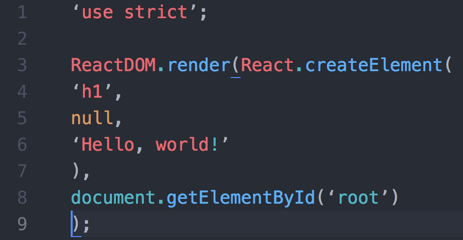

# Intro to React.js


## Learning Objectives

<!-- * Explain what a frontend framework is and why they can be helpful in writing more complex applications.
* Explain what ReactJS is and where it fits in our applications' stack.
* Explain the component model of web development.
* Create and return React components in the browser. -->

## Framing

<!-- ### What is a Frontend Framework? 

- A framework is software providing generic functionality and structure that serves as foundation to build and deploy applications.
- Express is a framework that runs on the server, receiving incoming request from the client, preforming some work that you have defined, and returning some response to the client.  Front-end frameworks run in the client's browser, receive input from interactions with the page, perform some work that you have defined, and make any updates necessary.
- Frameworks can help standardize code, give you additional functionality and performance, and can help get your code off the ground faster.  
- There are [many front end frameworks](https://2020.stateofjs.com/en-US/technologies/front-end-frameworks/)  and each go about solving problems of how state is managed, updated, and represented by a view but there are many commonalities.
- There is a lot of debate over whether frontend frameworks count as frameworks at all -- some people say that they are just libraries and should be referred to as such. -->

### What is React and Why do popele like it?
React is a JavaScript library for building interactive user interfaces.

As the the front end of your application becomes larger and more complex, trying to manage that complexity with vanilla JavaScript or even jQuery becomes difficult.

React provides powerful tools for managing that complexity. With React, the user interface is broken out into reusable building blocks called **components**. Each component can house its own logic, manage its own state, and pass information to other **components**.

React also performs very efficiently in the browser. If we think back to using server-side templates in the previous units, whenever we wanted to update the data on the page, we needed to refresh the entire page to see our changes. We could improve this with jQuery by only rerendering part of the page.

React takes this efficiency even further, using something called the **Virtual DOM**, we can rerender only the exact parts of the page that need to be rerendered and nothing more. What is even more beautiful is React handles all of this behind the scenes without us having to manage it.

<!-- > **Selling Point:** By modeling small compatible components that focus on just rendering a view, we can move business logic out of the DOM, and therefore improve our app's performance, maintainability, modularity and readability. -->

#### Some History

The first thing most people hear about React is "Facebook uses it."
* First used by Facebook in 2011.
* Then Instagram in 2012.
* Went open source in May 2013.

**BEHOLD! The OLD FACEBOOK!** 

*2008*


*2020*

 

React was born out of Facebook's frustration with the traditional MVC model and how...
  * Re-rendering something meant re-rendering everything (or just a lot).
  * That had negative implications on processing power and ultimately user experience, which at times became glitchy and laggy.


### React from horse's mouth

If you want to get a taste of what React is all about, [here's an introduction from React.js Conf 2015](https://www.youtube.com/watch?v=KVZ-P-ZI6W4&feature=youtu.be&t=510). Recommend starting around the 8:35 mark and watching until 16:30.

### React in MVC

React can be thought of as the "Views" layer in MVC, the part that the user will view and interact with.

React will work with any back-end language, but for our in-class examples we will be using Mongoose and Express for the models and controllers.

## A Break from Convention

In a traditional front end separation of concerns, we would have our markup (HTML) in one file and our logic (JavaScript) in another file. React strays from this concept mixing markup and logic in the same file, and instead separates concerns by **components**.

### What is a Component?

A component is a reusable chunk of UI, housing both the markup and the logic for that particular piece of user interface.

Looking at Facebook, you could think of each status post as a **component**. You could think of the status feed as a component that contains many of the smaller status post components within. You could take that one step further and think of the Facebook app, as one giant component with several components within it, including the friends list, the header, etc...

<!-- 
[Templates vs Components](https://wanderoak.co/fixed-templates-vs-components/)


> [WanderOak - Fixed Templates vs. Components](https://wanderoak.co/fixed-templates-vs-components/) -->

### Exercise
Let's see if we can identify the components in the Tube Tracker app below.


> [MakeTea - Building Robust Apps with React](http://maketea.co.uk/2014/03/05/building-robust-web-apps-with-react-part-1.html)

Notice the structure of how the various components are nested. 
```
- TubeTracker
    - Network
        - Line
    - Predictions
        - DepartureBoard
            - Trains
```

We can say that the entire Tube Tracker app is a component containing both the Network component and the Predictions component. We say that the Network and Predictions components are child components of the TubeTracker component and the TubeTracker component is a parent of the Network and the Predictions components. This parent/child relationship creates a tree-like structure which will become important to us later on.

## Exercise: Identifying Components

* Break into groups of three and take a look at a website of your choice (Facebook, Craigslist, Ebay, etc...). Identify the visual "components" the website is comprised of.

As you're drawing this out, think about the following questions...
* Where do you see "nested components"? Where do you not?
* Are there any components that share the same structure?
* Of these similar components, what is different about them?

----------------------------

## Code Along: Initial Setup

In order to create a new project and get our development environment setup, we are going to use the Terminal command `create-react-app`.

`create-react-app` is an NPM package that will handle the details of setting up a React project for us. It will install the necessary dependancies, and set up a server to serve our front end files to the browser. It will also watch our files for any changes and automatically update the browser when we save a file, also called "hot reloading".

<!-- that writes our build dependencies for us so that we can do less configuration. It allows us to use React, JSX, and ES6. It also allows us to import our CSS, it autoprefixes our CSS so that we don't have to worry about cross browser compatibility, it gives us a dev server to run, and it enables hot reloading which updates the code in our browser without us refreshing the page.

It uses Webpack which is a build tool that enables many of the features listed above. It also includes Babel which transpiles our JavaScript from ES6 to be compatible with older browsers. It also includes Autoprefixer for CSS compatibility, ESLint for linting, and Jest for testing. -->

<!-- You can also set up all this yourself, but for now `create-react-app` allows us to worry more about our code and less about configuration. -->

It is possible to set up a React environment yourself, however for now `create-react-app` allows us to focus on building with React and not worry about configuration.

Navigate to your React directory and run...
```bash
$ npx create-react-app my-app
$ cd my-app
$ npm start
```

We're using `npx` instead of `npm` here. `npx` allows us to run `create-react-app` without downloading the `create-react-app` package to our machines. `npx` allows us to run a hosted version of the package instead.

`create-react-app` will create a new directory for our React project. In this example we called it "my-app". Once you have navigated into the directory for your new React project run `$ npm start` to start up the server. We'll want to keep this server running while we are working on our app. You can now view your React app at `http://localhost:3000`! Take a look.

Along with installing the necessary dependencies, it creates an initial app skeleton that looks like this...

```bash
├──README.md
├──  favicon.ico
├──  index.html
├──  node_modules
├──  package.json
├──  public
│     └──index.html
└──  src
      ├──  App.css
      ├──  App.js
      ├──  index.css
      ├──  index.js
      └──  logo.svg
```

Take some time and look at what's been generated. Specifically look at `index.html`, `index.js`, and `App.js`.

### index.html

To render our React app on the page, our journey starts at the `/public/index.html` file.

When the browser first loads our app, the first thing to be loaded is this HTML file. We'll see a lot of comments in here explaining various parts of the file. For now, let's focus on the div in the body tag with the id of "root".

```html
<body>
  <div id="root"></div>
</body>
```

When our HTML file first loads on the page, some JavaScript will run behind the scenes to append our entire React application to this div with an id of "root".

### index.js

Let's take a looks inside `/src/index.js`. Notice the call to `ReactDOM.render()`.

```javascript
ReactDOM.render(
  <React.StrictMode>
    <App />
  </React.StrictMode>,
  document.getElementById('root')
);
```

<details>
  <summary>What is strict mode?</summary>

  The [StrictMode](https://reactjs.org/docs/strict-mode.html) component wrapping our app will perform additional checks and warnings, highlighting potential bugs or misuses or the React library.
</details>

This function call takes two arguments, the component we want to render, and the element on the page that we want to render our component to. This code will take our `<App />` component and render it on the page to the element with the id of "root".

Notice that before we render our `<App />` component to the page, we import it from another file, `./App.js`.

```javascript
import App from './App';
```

### App.js

Let's take a look inside `./src/App.js`.

```javascript
function App() {
  return (
    <div className="App">
      <h1>Some markup</h1>
    </div>
  );
}
```

Here we define a function, `App` that simply returns some markup. Pull up your React app in the browser side by side with this file and you'll notice that the markup up here is what is being rendered to the page. Play with it. Change the markup in the return statement, save the file, and watch the rendered outpage change as well.

### Components

This App function is a **React component**. Here in our `./src/App.js` file we are defining our React component just as we would define a function. Just like any other function in JavaScript we can pass parameters in the parentheses `()` and our function has a return statement.


### JSX

You'll notice something funny about this function. We are not returning regular JavaScript. Instead we are returning markup, something that looks an aweful lot like HTML. This HTML-like syntax is called [**JSX**](https://reactjs.org/docs/introducing-jsx.html).

Behind the scenes our `create-react-app` setup will convert this **JSX** code into regular old JavaScript before sending it to the browser. By using **JSX** we can write code that strongly resembles HTML, a language we are already familiar with, and is easy to read and write.

### Rendering a Component

Now that we've defined our **React component** (function) we can render it to the page with this syntax, `<App />`, just like we do in our `./src/index.js` file. When we write `<App />` we are simply calling the `App` function defined in `./src/App.js`.

Notice that we are also exporting our `App` component. In order to import `App` in our `./src/index.js` file we must first export it from `./src/App.js`.

<details>
  <summary>Hungry for More</summary>

  Behind the scenes our `create-react-app` setup is using a tool called "Webpack", which is using another tool called "Babel" to "transpile" this **JSX** into vanilla JavaScript and regular React code before bundling it up and sending it off to the browser.

  [Try it out yourself!](https://babeljs.io/repl)

  Using Babel's REPL you can define a component with React that returns JSX, and see what Babel will "transpile" your component into. It converts it into vanilla JavaScript and into JavaScript code written with the React library. Notice the function call to `React.createElement()`. Notice how this function is taking as arguments, the name of the element to be created, any HTML attributes attached to the element, and possibly another call to `React.createElement()` to render out the child elements of the parent.

  It is possible to write your React components this way by calling `React.createElement()`. However most developers agree using JSX is more intuitive and we'll be using JSX in this course.

  ### More about Babel
  Babel is a tool that can convert newer versions of JavaScript into a version of JavaScript widely supported by browsers. For example, ES12 => ES5.

  Babel can also be used to convert **JSX** into vanilla JavaScript and React code.

  ### What is Webpack?
  Webpack is a module bundler that can be configured to do all sorts of things in order to prepare our front end code into code that is ready to be sent to and read by a browser. For our uses, Webpack will take all of our React and JavaScript code, convert it into vanilla JavaScript, bundle it into a single JavaScript file, and then append it in a script tag to our `index.html` file. We can actually find this script tag by opening up the elements panel with our React app open.
</details>

At this point, take another look at the three files we've seen so far, `/public/index.html`, `/src/index.js`, and `/src/App.js`. See if you can trace the path that eventually leads to our `App` component rendering to the page.

## Code Along: Let's Code

<!-- Throughout class we have separated HTML, CSS and Javascript.
* With components, the lines between those three become a bit blurry.
* Instead, we organize our web apps according to small, reusable components that define their own content, presentation and behavior. -->

<!-- What does a component look like? Let's start with a simple "Hello World" example... -->

In our `/src/App.js` file, let's remove the boilerplate content that `create-react-app` sets up for us. We'll leave the App function intact and replace the return value with any markup you wish and watch it render to the page.

```javascript
function App() {
  return (
    <div>
      <h1>My React App</h1>
      <h2>Todo List:</h2>
      <ul>
        <li>Learn about components</li>
        <li>Learn about props</li>
        <li>Learn about state</li>
        <li>Give the dog a bath</li>
      </ul>
    </div>
  );
}

export default App;
```

As a rule the returned JSX can only have a single parent element.

This code would break.
```javascript
function App() {
  return (
    <h1>My React App</h1>
    <p>This is a paragraph tag</p>
  );
}
```

This would not.
```javascript
function App() {
  return (
    <div>
      <h1>My React App</h1>
      <p>This is a paragraph tag</p>
    </div>
  );
}
```

You can also wrap your markup in something called a [React fragment](https://reactjs.org/docs/fragments.html) which will not render as actual HTML in the browser.

```javascript
function App() {
  return (
    <>
      <h1>My React App</h1>
      <p>This is a paragraph tag</p>
    </>
  );
}
```

We can get rid of both import statements as we won't need those resources.

## Child Components

Remember how we said a component can have many child components within it? To understand this concept let's create a `Person` component and make it a child of the `App` component.

Create a new directory called `components` inside of your `src` directory.

In the terminal run
```bash
mkdir ./src/components
```

Create a file called `Person.js` in the `components` directory.
```bash
touch ./src/components/Person.js
```

Inside of the `Person.js` file, let's define our `Person` component and export it from the file.

```JS
function Person() {
  return (
    <div>
      <h2>Name: Flynn</h2>
      <p>Favorite Color: Blue</p>
    </div>
  );
}

export default Person;
```

We simply define a function called Person that returns some JSX.

- Notice how Person is capitalized. React components are always capitalized. We'll explain why in a bit.

- Notice how we wrap the JSX code in a set of parentheses. This allows us to put the JSX on a new line after the return and makes it easier to read.

- Notice the export statement which will allow us to import the component into another file.

Let's navigate back to the `App.js` file. First let's import our new `Person` component into `App.js`. Then let's render our `Person` component inside the `App` component replacing the existing content we had in there.

```javascript
import Person from './components/Person';

function App() {
  return (
    <div className="App">
      <h1>My React App</h1>
      <Person />
    </div>
  );
}

export default App;
```

To render (or call) the `Person` component we simply include it in our JSX inside a set of opening and closing angle brackets. In this way the `Person` component is a child of the `App` component. The `App` component is a parent to the `Person` component. Any time we render the `App` component we will also render the `Person` component.

We can now easily create many instances of the `Person` component. We can render it as many times as we want.

```javascript
import Person from './components/Person';

function App() {
  return (
    <div className="App">
      <h1>My React App</h1>
      <Person />
      <Person />
      <Person />
    </div>
  );
}

export default App;
```

<!-- > Hey you got your html in my javascript!
>
> You got your javascript in my html!
>
> (https://youtu.be/O7oD_oX-Gio?t=5s) -->

<!-- Let's talk about the value that the render method returns. It looks an awful lot like an HTML heading, but it's not. We often write out React components in JSX.

JSX is [a language that compiles to Javascipt](https://reactjs.org/docs/introducing-jsx.html) that allows us to write code that strongly resembles HTML. It is eventually compiled to lightweight JavaScript objects.

Your Hello function: -->

<!-- * Currently returns JSX, not HTML.
The JSX creates a heading with 'Hello World!'.
* Your component reads this and renders a "Hello World!" heading.

> React can be written without JSX. If you want to learn more, [check out this blog post](http://jamesknelson.com/learn-raw-react-no-jsx-flux-es6-webpack/).  

Here is an example of React code without JSX-

 -->


## Virtual DOM 

<!-- You may have noticed that our `src/index.js` code mentions ReactDOM. ReactDOM doesn't refer to the same DOM we know. Instead, it refers to a Virtual DOM. The Virtual DOM is a key piece of how React works.

The Virtual DOM is a Javascript representation of the actual DOM. The virtual DOM is a staging area for changes that will eventually be implemented.

* Because of that, React can keep track of changes in the actual DOM by comparing different instances of the Virtual DOM.
* React then isolates the changes between old and new instances of the Virtual DOM and then only updates the actual DOM with the necessary changes.
* By only making the "necessary changes," as opposed to re-rendering an entire view altogether, we save up on processing power.
* This is not unlike Git, with which you compare the difference -- or `diff` -- between two commits.


> If you're interested in learning more about the Virtual DOM, [check this video out](https://www.youtube.com/watch?v=-DX3vJiqxm4).

So we've created the template for our component. Now, let's use `/src/index.js` to load in our new component and render it on the DOM... -->

<!-- ```js
import React from 'react'
import ReactDOM from 'react-dom'
import Hello from './App.js'

ReactDOM.render(
  <Hello />,
  document.getElementById('root')
)
```
> In place of `ReactDOM.render` some tutorials will use React.renderComponent, which has been phased out. The change is outlined [here](http://bit.ly/1E81Whs).

`ReactDOM.render` takes the Virtual DOM node created by `extends Component` and adds it to the actual DOM. It takes two arguments...

  1. The component.
  2. The DOM element we want to append it to.

> **NOTE:** Whenever you use a self-closing tag in JSX, you **MUST** end it with a `/` like `<Hello />` in the above example. -->

<!-- --- -->

<!-- ### Review Questions
- How does JSX make your life as a developer easier?
- What are some of the advantages of having a virtual DOM? -->


## Hello World: A Little Dynamic

Our `Hello` component isn't too helpful. Let's make it more interesting.
* Rather than simply display "Hello world", let's display a greeting to the user.
* So the question is, how do we feed a name to our `Hello` component without hardcoding it into our render method?

First, we pass in data wherever we are rendering our component, in this case in `src/index.js`...

```js
import React from 'react'
import ReactDOM from 'react-dom'
import Hello from './App.js'

ReactDOM.render(
  <Hello name={"Nick"} />,
  document.getElementById('root')
)
```

Then in our component definition, we have a reference to that data via as a property on the `props` object...

```js
function Hello(props) {
  return (
      <h1>Hello {props.name}</h1>
  );
}
```

In the above example, we replaced "world" with `{props.name}`.

### What are `.props`?

Properties! Every component has `.props`
* Properties are immutable. That is, they cannot be changed while your program is running.
* We define properties in development and pass them in as attributes to the JSX element in our `.render` method.

First we can pass multiple properties to our component when its rendered in `src/index.js`..

```js
import React from 'react';
import ReactDOM from 'react-dom'
import Hello from './App.js'

ReactDOM.render(
  <Hello name={"Nick"} age={24} />,
  document.getElementById('root')
)
```

Then in our component definition we have access to both values...

```js
function Hello(props) {
  return (
    <div>
      <h1>Hello {props.name}</h1>
      <p>You are {props.age} years old</p>
    </div>
  );
}
```

> **NOTE:** The return statement in `render` can only return one DOM element. You can, however, place multiple elements within a parent DOM element, like we do in the above example with `<div>`.

---

## You Do: A Blog Post 

Let's have some practice creating a React component from scratch. How about a blog post?
* Create a `post` object literal in `src/index.js` above `ReactDOM.render()` that has the below properties.
  1. `title`
  2. `author`
  3. `body`
  4. `comments` (array of strings)
* Render these properties using a Post component.
* The composition of your Post is up to you.

If you finish early, try experimenting with CSS (Make Sure you use `className` instead of `class` in `JSX`!)


<details><summary>Solution</summary>

*Post.js*

```
import React from 'react';

function Post(props) {
	return(
        <div>
            <h1>{props.title}</h1>
            <p>By {props.author}</p>
            <div>
                <p>{props.body}</p>
            </div>
            <h3>Comments:</h3>    
            <p>{props.comments[0]}</p>
        </div>
    )
}

export default Post;
```

*index.js*

```
import Post from './Post';

const post = {
    title: "Avengers",
    author: "Nick Fury",
    body: "I secretly recruited a group of superheroes to save our world.",
    comments: [
      "I love Avengers.",
      "Forget Avengers, we want the Witcher.",
		"At least let aliens destroy D&D for what they did to GOT!"
    ]
}

ReactDOM.render(
    <Post 
        title={post.title} 
        author={post.author}
        body={post.body} 
        comments={post.comments}/>, 
    document.getElementById('root')
);
```

</details>


---


#### Q: What problems did you encounter when trying to add multiple comments to your Post?

It would be a pain to have to explicitly define every comment inside of `<Post />`, especially if each comment itself had multiple properties.
* This problem is a tell tale sign that our separation of concerns is being stretched, and it's time to break things into a new component.

We can nest a Comment component within a Post component.
* We create these comments the same way we did with posts
* Then we can reference a comment using `<Comment />` inside of Post's return method.

Let's create a new file for our Comment component, `src/Comment.js`...

```js
import React from 'react';

const Comment = (props) => {
    return(
        <div>
            <p>{props.message}</p>
        </div>
    )
}

export default Comment;
```

Then in `src/Post.js`, we need to load in our `Comment` component and render it inside of our `Post` component...

```js
import React from 'react';
// Load in Comment component
import Comment from './Comment.js'


function Post(props) {
	return (
	  <div>
	    <h1>{props.title}</h1>
	    <p>By {props.author}</p>
	    <div>
	      <p>{props.body}</p>
	    </div>
	    <h3>Comments:</h3>
	    // Render Comment component, passing in data
	    <Comment message={props.comments[0]} />
	  </div>
	);
}

export default Post;
```

> **Note**: We could put all of our code in one file, but it's considered a good practice to break components out into different files to help practice separation of concerns. The only downside is we have to be extra conscious of remembering to **export / import** each component to where it's rendered.

The above code works, but we'd have to hard-code all of our `Comments`.  This is not very dry and our code will not dynamically change.  The best way to handle this is to set a variable equal to all of the `<Comments />` for this post.  We can do this using `.map` in `Post` function.

We can use `.map` in `Post` function to avoid having to hard-code all of our `Comments`

```js
import React from 'react';
import Comment from './Comment';

function Post(props) {
    let comments = props.comments.map((comment, index) => (
        <Comment message={comment} key={index}/>
    ))

    return(
        <div>
            <h1>{props.title}</h1>
            <p>By {props.author}</p>
            <div>
                <p>{props.body}</p>
            </div>
            <h3>Comments:</h3>    
            {comments}
        </div>
    )
}

export default Post;
```

---

## Closing

* Why do we use components in React?
* What is the Virtual DOM?
* What is JSX?
* What features does `create-react-app` give us?
