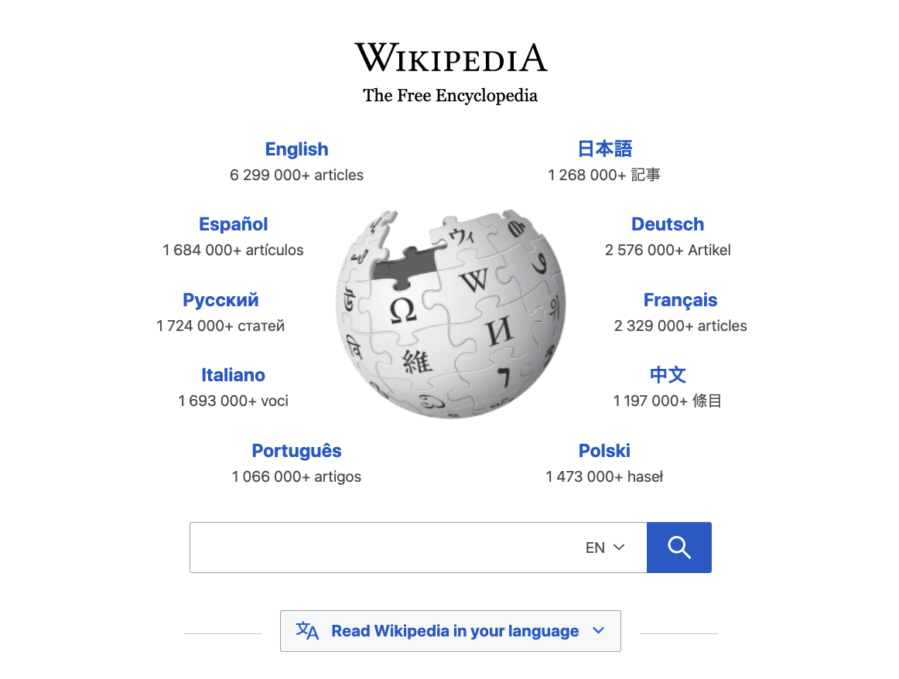
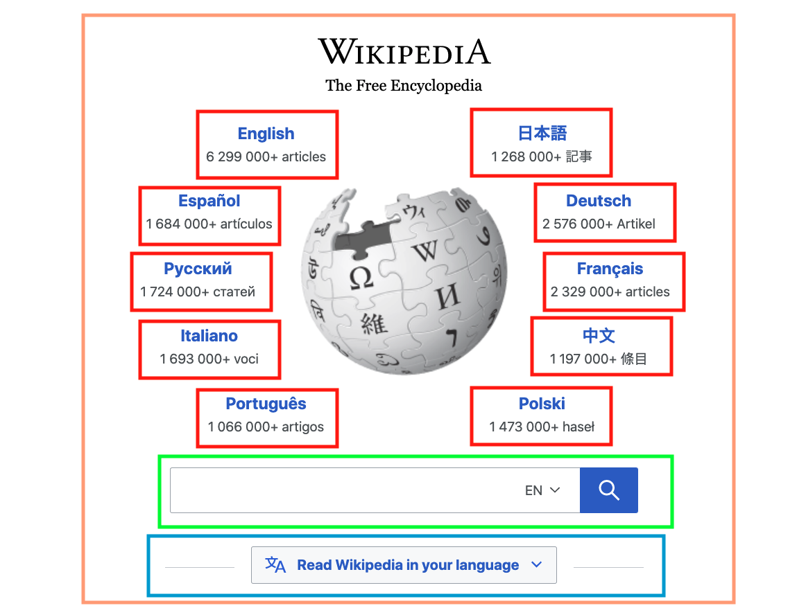
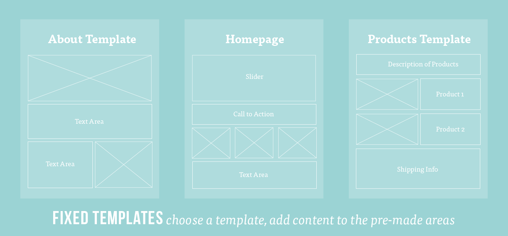

# Intro to React.js


## Learning Objectives
- An overview of what React is and why it is popular
- Set up a React application
- Create components
- Render components within other components
- Parent/Child Relationship with React components

[React Documentation](https://reactjs.org/)

<!-- ## Framing -->

<!-- ### What is a Frontend Framework? 

- A framework is software providing generic functionality and structure that serves as foundation to build and deploy applications.
- Express is a framework that runs on the server, receiving incoming request from the client, preforming some work that you have defined, and returning some response to the client.  Front-end frameworks run in the client's browser, receive input from interactions with the page, perform some work that you have defined, and make any updates necessary.
- Frameworks can help standardize code, give you additional functionality and performance, and can help get your code off the ground faster.  
- There are [many front end frameworks](https://2020.stateofjs.com/en-US/technologies/front-end-frameworks/)  and each go about solving problems of how state is managed, updated, and represented by a view but there are many commonalities.
- There is a lot of debate over whether frontend frameworks count as frameworks at all -- some people say that they are just libraries and should be referred to as such. -->

## What is React?

[React](https://reactjs.org/) is a powerful JavaScript library for building interactive user interfaces. React allows us to break our front end application into **components**. For now we can think of **components** as small reusable building blocks that will make up the HTML of our application. We can than piece these building blocks together like Lego blocks to build our front end.

## Why React?

### Easily Interact with the DOM

With the DOM API (for example, `document.getElementById()`, `document.createElement()`) we had the ability to dynamically interact with the DOM (the Document Object Model), updating content, creating and removing elements on the page. React will allow us to do the same thing, but in an easier and more efficient way. We will dive more into this throughout the next few lessons.

### Provides a Way to Organize our Code

As the the front end of your application becomes larger and more complex, trying to manage that complexity with vanilla JavaScript or even jQuery becomes difficult. The JavaScript language alone doesn't provide us with tools to organize our code.

React provides powerful tools for organizing our code and managing complexity. With React, the user interface is broken out into reusable building blocks called **components**. We can piece these components together like lego blocks to build scalable user interfaces.

<!-- JQUERY VERSION ================================================================= -->
<!-- With jQuery we had the ability to dynamically interact with the DOM, updating content, creating and removing elements on the page, without having to trigger a full page refresh. In this way React will take the place of jQuery.

As the the front end of your application becomes larger and more complex, trying to manage that complexity with vanilla JavaScript or even jQuery becomes difficult. The jQuery library alone doesn't provide us with tools to organize our code.

React provides powerful tools for managing that complexity, giving us tools to organize our code. With React, the user interface is broken out into reusable building blocks called **components**. Each component can house its own logic, manage its own state, and pass information to other **components**.

React also performs very efficiently in the browser. If we think back to using server-side templates in the previous units, whenever we wanted to update the data on the page, we needed to refresh the entire page to see our changes. We could improve this with jQuery by only rerendering part of the page.

React takes this efficiency even further, using something called the **Virtual DOM**, we can rerender only the exact parts of the page that need to be rerendered and nothing more. What is even more beautiful is React handles all of this behind the scenes without us having to manage it. -->

<!-- > **Selling Point:** By modeling small compatible components that focus on just rendering a view, we can move business logic out of the DOM, and therefore improve our app's performance, maintainability, modularity and readability. -->

<!-- TODO: CONSIDER BRINGING THE FACEBOOK HISTORY BACK ON SOME LEVEL -->

<!-- #### Some History

The first thing most people hear about React is "Facebook uses it."
* First used by Facebook in 2011.
* Then Instagram in 2012.
* Went open source in May 2013.

**BEHOLD! The OLD FACEBOOK!**  -->

<!-- *2008*


*2020*

 

React was born out of Facebook's frustration with the traditional MVC model and how...
  * Re-rendering something meant re-rendering everything (or just a lot).
  * That had negative implications on processing power and ultimately user experience, which at times became glitchy and laggy. -->


### React from horse's mouth

If you want to get a taste of what React is all about, [here's an introduction from React.js Conf 2015](https://www.youtube.com/watch?v=KVZ-P-ZI6W4&feature=youtu.be&t=510). Recommend starting around the 8:35 mark and watching until 16:30.

### React in MVC

React can be thought of as the "Views" layer in MVC, the part that the user will view and interact with.

React will work with any back-end language, but for our in-class examples we will be using Mongoose and Express for the models and controllers.

## A Break from Convention

In a traditional front end separation of concerns, we would have our markup (HTML) in one file and our logic (JavaScript) in another file. React strays from this concept mixing markup and logic in the same file, and instead separates concerns by **components**.

### What is a Component?

A component in React is a reusable chunk of user interface (UI).

Using the homepage of Wikipedia as an example, we could think of each language section as an instance of a language component. Each language section has the same structure but different content.



If we were to draw a box around each component on the homepage it might look something like this.



We might have many instances of a language component (red), a component for the search bar (green), and a component for the dropdown button (blue). All of these components might live inside of a parent component for the page (orange). In this way, all of these components would be children of the page component.

In this way, we are able to break our user interface (UI) into smaller more manageble chunks. Each component holds the markup and the functionality for that particular chunk of UI.

### Another Example

Using Facebook as an example, you could think of each status post as a **component**. Each status post has the same structure but it might have different content, a different image, different text, and it might be associated with a different user.


You could then think of the news feed as a component that contains many of the smaller status post components within it. You could take this further and think of the entire page as a component. The news feed component would be a child of the page component. The sidebar and the header components would be children of the page component as well.


<!-- 
[Templates vs Components](https://wanderoak.co/fixed-templates-vs-components/)



> [WanderOak - Fixed Templates vs. Components](https://wanderoak.co/fixed-templates-vs-components/) -->


<!-- Let's see if we can identify the components in the Tube Tracker app below.


> [MakeTea - Building Robust Apps with React](http://maketea.co.uk/2014/03/05/building-robust-web-apps-with-react-part-1.html)

Notice the structure of how the various components are nested. 
```
- TubeTracker
    - Network
        - Line
    - Predictions
        - DepartureBoard
            - Trains
```

We can say that the entire Tube Tracker app is a component containing both the Network component and the Predictions component. We say that the Network and Predictions components are child components of the TubeTracker component and the TubeTracker component is a parent of the Network and the Predictions components. This parent/child relationship creates a tree-like structure which will become important to us later on. -->

## Exercise: Identifying Components

* Break into groups of three and take a look at a website of your choice (Facebook, Craigslist, Ebay, etc...). Identify the visual "components" the website is comprised of.

As you're drawing this out, think about the following questions...
* Where do you see "nested components"? Where do you not?
* Are there any components that share the same structure?
* Of these similar components, what is different about them?

----------------------------

## Code Along: Initial Setup

In order to create a new project and get our development environment setup, we are going to use a tool called `create-react-app`.

`create-react-app` is an NPM package that will handle the details of setting up a React project for us. It will install the necessary dependancies, and set up a server to serve our front end files to the browser. It will also watch our files for any changes and automatically update the browser when we save a file, also called "hot reloading".

It is possible to set up a React environment yourself, and many companies will set up their own custom React environments. However for our use cases, `create-react-app` will allow us to focus on learning how to use React and not worry about configuration.

In your terminal, navigate to the directory where you would like to create your React app. And then run the following commands.
```bash
$ npx create-react-app my-app
$ cd my-app
$ npm start
```

The command may take a few minutes to complete depending on your internet connection. `create-react-app` will create a new directory for our React project. For our example it will create a directory called 'my-app'. Inside the directory it will set up our React environment, complete with a server that will serve our React app to the browser.

We're using `npx` instead of `npm` here. `npx` allows us to run `create-react-app` without downloading the `create-react-app` package to our machines. `npx` allows us to run a hosted version of the package instead.

Navigate into the directory for your new React project.
```bash
cd my-app
```

And then start up the server.
```bash
npm start
```

We'll want to keep this server running while we are working on our app. You can now view your React app at `http://localhost:3000`! Take a look.

Open your new React app up in your code editor and take a look inside. You'll see a lot of files in here. Many of them are not important for us to uderstand at the moment. We'll just focus on the core pieces.

Along with installing the necessary dependencies, `create-react-app` creates an initial app skeleton that looks like this...

```bash
├──  README.md
├──  favicon.ico
├──  index.html
├──  node_modules
├──  package.json
├──  public
│     └──index.html
└──  src
      ├──  App.css
      ├──  App.js
      ├──  index.css
      ├──  index.js
      └──  logo.svg
```

Take some time and look at what's been generated. Specifically look at `index.html`, `index.js`, and `App.js` inside the `public` directory and the `src` directory.

### index.html

To render our React app on the page, our journey starts at the `/public/index.html` file.

When the browser first loads our app, the first thing to be loaded is this HTML file. We'll see a lot of comments in here explaining various parts of the file. For now, let's focus on the div in the body tag with the id of "root".

```html
<body>
  <div id="root"></div>
</body>
```

When our HTML file first loads on the page, some JavaScript will run behind the scenes to append our entire React application to this div with an id of "root".

### index.js

Let's take a looks inside `/src/index.js`. Notice the call to `ReactDOM.render()`.

```javascript
ReactDOM.render(
  <React.StrictMode>
    <App />
  </React.StrictMode>,
  document.getElementById('root')
);
```

<details>
  <summary>Hungry for More: What is strict mode?</summary>

  The [StrictMode](https://reactjs.org/docs/strict-mode.html) component wrapping our app will perform additional checks and warnings, highlighting potential bugs or misuses or the React library.
</details>

This function call takes two arguments, the component we want to render, and the element on the page that we want to render our component to. This code will take our `<App />` component and render it on the page to the element with the id of "root".

Notice that before we render our `<App />` component to the page, we import it from another file, `App.js`.

```javascript
import App from './App';
```

### App.js

Let's take a look inside `./src/App.js`.

```javascript
function App() {
  return (
    <div className="App">
      <h1>Some markup</h1>
    </div>
  );
}
```

Here we define a function, `App` that simply returns some markup (HTML). Pull up your React app in the browser side by side with this file and you'll notice that the markup up here is what is being rendered to the page. Try changing the markup in the return statement. Change the content. Add an HTML element. Save the file, and watch the rendered outpage change as well.

### Components

This App function is a **React component**. Here in our `App.js` file we are defining our React component just as we would define a function. Just like any other function in JavaScript we can pass parameters in the parentheses `()` and our function has a return statement.


### JSX

You'll notice something funny about this function. We are not returning regular JavaScript. Instead we are returning markup, something that looks an aweful lot like HTML. This HTML-like syntax is called [**JSX**](https://reactjs.org/docs/introducing-jsx.html).

Behind the scenes our `create-react-app` setup will convert this **JSX** code into regular old JavaScript before sending it to the browser. By using **JSX** we can write code that strongly resembles HTML, a language we are already familiar with, and is easy to read and write.

### Rendering a Component

Now that our **React component** (function) has been defined we can render it to the page with this syntax, `<App/>`, just like we do in our `index.js` file. When we write `<App/>` we are calling the `App` function defined in `App.js` which just returns some markup.

Notice that we are also exporting our `App` component. In order to import `App` in our `index.js` file we must first export it from `./src/App.js`.

At this point, take another look at the three files we've seen so far, `/public/index.html`, `/src/index.js`, and `/src/App.js`. See if you can trace the path that eventually leads to our `App` component rendering to the page.

<details>
  <summary>Hungry for More: How does JSX get converted to JavaScript?</summary>

  Behind the scenes our `create-react-app` setup is using a tool called "Webpack", which is using another tool called "Babel" to "transpile" this **JSX** into vanilla JavaScript and regular React code before bundling it up and sending it off to the browser.

  [Try it out yourself!](https://babeljs.io/repl)

  Using Babel's REPL you can define a component with React that returns JSX, and see what Babel will "transpile" your component into. It converts it into vanilla JavaScript and into JavaScript code written with the React library. Notice the function call to `React.createElement()`. Notice how this function is taking as arguments, the name of the element to be created, any HTML attributes attached to the element, and possibly another call to `React.createElement()` to render out the child elements of the parent.

  It is possible to write your React components this way by calling `React.createElement()`. However most developers agree using JSX is more intuitive and we'll be using JSX in this course.

  ### More about Babel
  Babel is a tool that can convert newer versions of JavaScript into a version of JavaScript widely supported by browsers. For example, ES12 => ES5.

  Babel can also be used to convert **JSX** into vanilla JavaScript and React code.

  ### What is Webpack?
  Webpack is a module bundler that can be configured to do all sorts of things in order to prepare our front end code into code that is ready to be sent to and read by a browser. For our uses, Webpack will take all of our React and JavaScript code, convert it into vanilla JavaScript, bundle it into a single JavaScript file, and then append it in a script tag to our `index.html` file. We can actually find this script tag by opening up the elements panel with our React app open.
</details>

## Code Along: Let's Code

<!-- Throughout class we have separated HTML, CSS and Javascript.
* With components, the lines between those three become a bit blurry.
* Instead, we organize our web apps according to small, reusable components that define their own content, presentation and behavior. -->

<!-- What does a component look like? Let's start with a simple "Hello World" example... -->

In our `/src/App.js` file, let's remove the boilerplate content that `create-react-app` sets up for us. We'll leave the App function intact and replace the return value with any markup you wish and watch it render to the page.

```javascript
function App() {
  return (
    <div>
      <h1>My React App</h1>
      <h2>Todo List:</h2>
      <ul>
        <li>Learn about components</li>
        <li>Learn about props</li>
        <li>Learn about state</li>
        <li>Give the dog a bath</li>
      </ul>
    </div>
  );
}

export default App;
```

As a rule the returned JSX can only have a single parent element.

This code would break.
```javascript
function App() {
  return (
    <h1>My React App</h1>
    <p>This is a paragraph tag</p>
  );
}
```

This would not.
```javascript
function App() {
  return (
    <div>
      <h1>My React App</h1>
      <p>This is a paragraph tag</p>
    </div>
  );
}
```

You can also wrap your markup in something called a [React fragment](https://reactjs.org/docs/fragments.html) which will not render as actual HTML in the browser for the empty tags (`<>` and `</>`).

```javascript
function App() {
  return (
    <>
      <h1>My React App</h1>
      <p>This is a paragraph tag</p>
    </>
  );
}
```

At the top of the file we can get rid of the import statements for the logo but keep the one for the CSS.

---

## Child Components

Remember how we said a component can have many child components within it? To understand this concept let's create a `Person` component and make it a child of the `App` component.

Create a new directory called `components` inside of your `src` directory.

In the terminal run
```bash
mkdir ./src/components
```

Create a file called `Person.js` in the `components` directory.
```bash
touch ./src/components/Person.js
```

Inside of the `Person.js` file, define our `Person` component and export it from the file.

```JS
function Person() {
  return (
    <div>
      <h2>Name: Flynn</h2>
      <p>Favorite Color: Blue</p>
    </div>
  );
}

export default Person;
```

We simply define a function called Person that returns some JSX.

- Notice how Person is capitalized. React components are always capitalized. We'll explain why in a bit.

- Notice how we wrap the JSX code in a set of parentheses. This allows us to put the JSX on a new line after the return and makes it easier to read.

- Notice the export statement which will allow us to import the component into another file.

Let's navigate back to the `App.js` file. First let's import our new `Person` component into `App.js`. Then let's render our `Person` component inside the `App` component replacing the existing content we had in there.

```javascript
import Person from './components/Person';
import './App.css';

function App() {
  return (
    <div className="App">
      <h1>My React App</h1>
      <Person />
    </div>
  );
}

export default App;
```

To render (or call) the `Person` component we simply include it in our JSX inside a set of opening and closing angle brackets. In this way the `Person` component is a child of the `App` component. The `App` component is a parent to the `Person` component. Any time we render the `App` component we will also render the `Person` component.

---

### Creating Many Instances

We can now easily create many instances of the `Person` component. We can render it as many times as we want.

```javascript
import Person from './components/Person';
import './App.css';

function App() {
  return (
    <div className="App">
      <h1>My React App</h1>
      <Person />
      <Person />
      <Person />
    </div>
  );
}

export default App;
```

---

### Multiple Child Components

Let's define a `Dog` component the same way we defined our `Person` component and then render it in our `App` component.

Create a file called `Dog.js` in your `components` directory.

```bash
touch ./src/components/Dog.js
```

Define the component returning some markup and export it at the bottom of the file.
```javascript
function Dog() {
  return (
    <div>
      <h2>Name: Sparky</h2>
      <p>Favorite Activity: Chasing the ball</p>
    </div>
  );
}

export default Dog;
```

Import it into the `App.js` file and then render the `Dog` component within the `App` component with `<Dog />`. We can create as many instances of the `Dog` component as we want. Here we render it twice.

```javascript
import Person from './components/Person';
import Dog from './components/Dog';
import './App.css';

function App() {
  return (
    <div className="App">
      <h1>My React App</h1>
      <Person />
      <Person />
      <Person />
      <Dog />
      <Dog />
    </div>
  );
}

export default App;
```

---

<!-- TODO: Activity: Create a Cat Component  -->

<!-- TODO: Create a house component and render the Person, Dog, and Cat components inside the house component -->

That concludes the code along for this lesson. We are starting to get a sense for how a React application can be constructed with these building blocks called **components**.


## The Virtual DOM

A big benefit of React is that it performs very efficiently in the browser. If we think back to using server-side templates in the previous units, whenever we wanted to update the data on the page, we needed to refresh the entire page to see our changes. In Unit 1, we learned how we could use the DOM API to update data on just a part of the page without refreshing the whole page. (for example, `listEl.append(listItemEl)` or `listItemEl.textContent('New content')`)

React takes this efficiency further, using something called the **Virtual DOM**. With the **Virtual DOM**, whenever we need to update our webpage, we can update only the parts of the page that need to be updated and nothing more. One of the best parts is, React does this behind the scenes without us having to manage it or worry about it.

---

When our `index.html` file initially renders in the browser, React, using the DOM API under the hood, will take all of the **JSX** in our **components** and append it to the page as HTML.

Before it appends all that HTML to the page, it will create a giant JavaScript object representing all of the markup in the app and hold that JavaScript object in the browser's memory. This giant JavaScript object is a virtual representation of the DOM, the **Virtual DOM**.

In our Recipes App, let's say we were to click on a different category. We would want to see the details for that category and see the recipes for that category.

When the state of our application changes, React will compare the old version of our **Virtual DOM** with the new version of our **Virtual DOM**, note the differences, and only render the exact parts of the page that need need to change. We will revisit the concept when we work with **state** in React, but for now, know that the **Virtual DOM** allows React to be highly efficient in how it renders and changes content on the page.

[The React Docs on the Virtual DOM](https://reactjs.org/docs/faq-internals.html#what-is-the-virtual-dom)

## Review

* What is a component in React?
* What benefits do components provide?
* What is the parent/child relationship of the Recipes App we've created?
* How is our React app rendered to the page in the browser?
* What is JSX?
* What is the Virtual DOM?
* What features does `create-react-app` give us?

## Additional Resources

The [React documentation](https://reactjs.org/) is well put together and a great place to learn more about React.

The [Introductory Tutorial](https://reactjs.org/tutorial/tutorial.html) featured on the React documentation will give you a good introduction to using **props** and **state** in React and will be a good primer on some of the topics we will be covering in the next few lessons.
